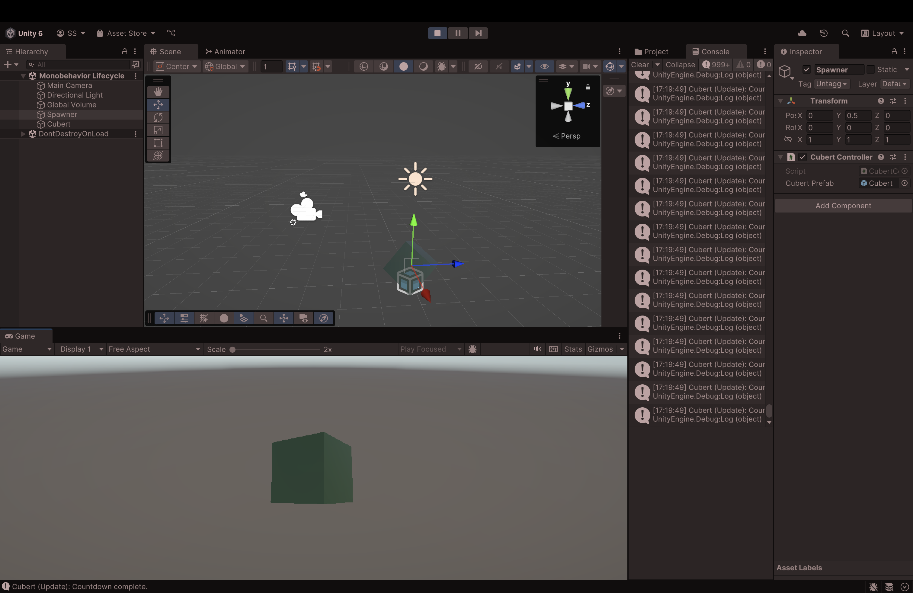

# MonobehaviorLifecycle

A Unity 3D demo that brings the MonoBehaviour lifecycle to life using a humble cube named **Cubert**. Watch how Cubert reacts at every stage of Unity's execution order and interact with him using simple keyboard inputs.

---

## 🎮 Controls

| Key | Action              |
|-----|---------------------|
| `C` | Create Cubert       |
| `E` | Enable/Disable Cubert |
| `D` | Destroy Cubert      |

---

## 🧠 What You'll Learn

- How Unity lifecycle methods (`Awake`, `Start`, `Update`, `FixedUpdate`, etc.) are triggered
- Real-world use cases for each lifecycle stage
- What to avoid (with reasoning and examples)
- How to programmatically create, disable, and destroy GameObjects

---

## 🛠️ Setup Instructions

1. Clone or download this repository.
2. Open the project with Unity (recommended: Unity 2020.3+).
3. Open the `Monobehavior Lifecycle` scene under `Assets/Scenes/`.
4. Press Play and use the controls to interact with Cubert.

---

## 🗂️ Folder Structure

```
Assets/
├── Prefabs/             # Contains Cubert prefab with attached script and Rigidbody
├── Scenes/              # Includes Main.unity scene with setup
└── Scripts/
    ├── CubertLifecycle.cs     # Handles MonoBehaviour lifecycle events
    └── CubertController.cs    # Handles keyboard inputs to manage Cubert
```

---

## 📸 Preview
 
 
(*Imagine Cubert rotating, responding, and logging lifecycle messages!*)


